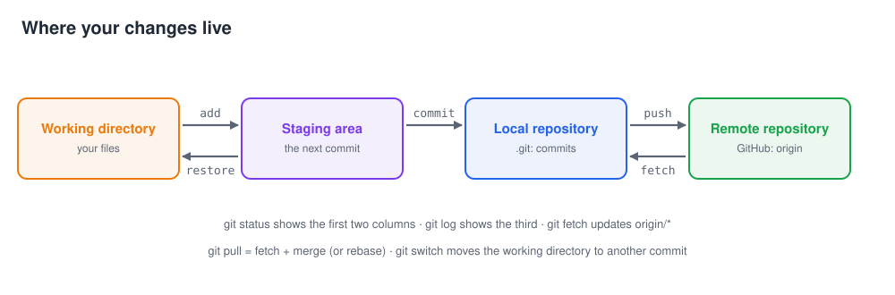
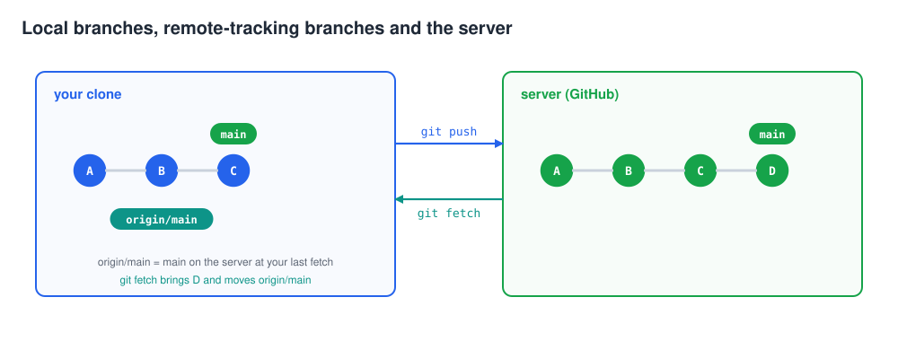
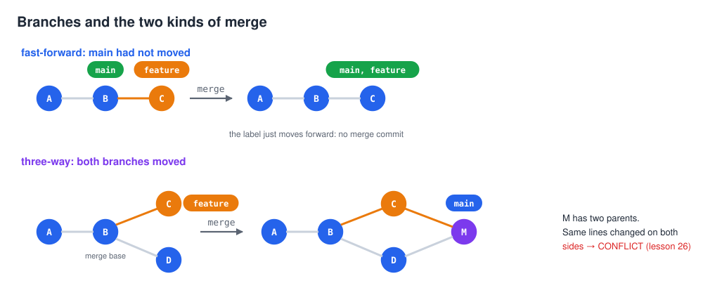
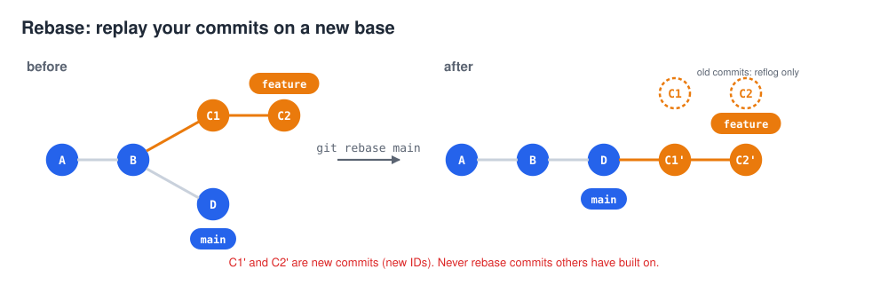
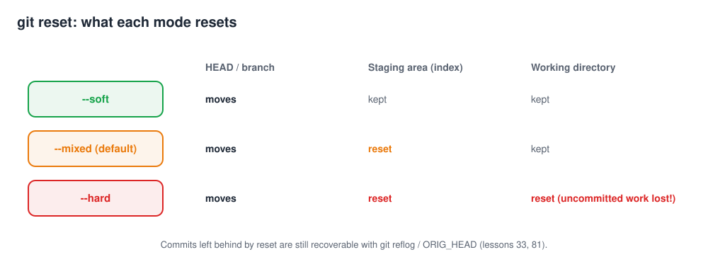
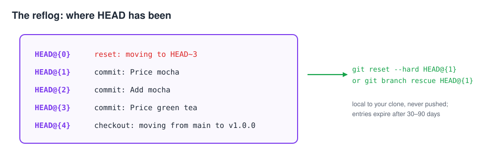
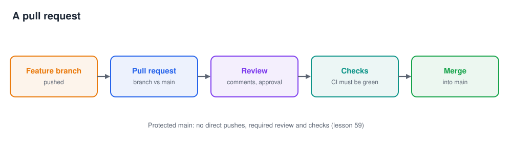
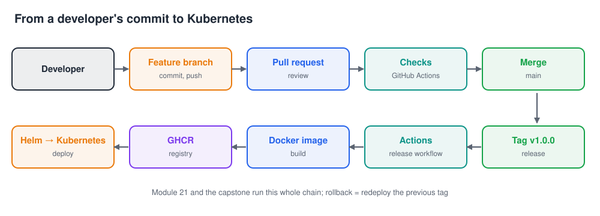

# Git Practical Course · Git & GitHub From Beginner to Advanced

[](https://github.com/sufyanahmadkamboh/sufyan-devops-git-practical-course/actions/workflows/test.yml)

Learn Git and GitHub by doing, the way they are used in DevOps teams: 98 hands-on lessons from your first commit to
interactive rebase, recovery, hooks, security, pull requests, releases and GitHub Actions, then a DevOps workflow,
18 troubleshooting labs, six projects, a capstone that ends with a release deployed to Kubernetes, and a final exam.

```text
Git basics → repositories → commits → history → branches → merging → undoing → stash → remotes → GitHub
  → authentication → pull requests → collaboration → rebase → advanced Git → internals → recovery → hooks
  → large repositories → security → GitHub advanced → DevOps workflow → troubleshooting → projects → capstone
```

**Every command is tested.** Each lesson is a script as well as a text: 1,308 code blocks run automatically, in a
sandbox, with the latest Git (2.54 on the author's computer, the newest Git from the git-core PPA in GitHub Actions).
The outputs shown in the lessons are the real outputs of those runs. The 153 blocks that need a GitHub account ran
against GitHub itself on the author's account (a practice repository, real pull requests, releases and Actions runs).

## How every lesson works

Each concept gets its own lesson, and every lesson follows the same path:

```text
Understand → Visualize → Execute → Observe → Break → Troubleshoot → Fix → Practice → Challenge → Real world
```

| Section | What you do |
|---|---|
| What are we learning? | the concept in plain words |
| Visual | a diagram of what Git does |
| Lab setup | one command creates a practice repository with a known history (same commit IDs as the lesson) |
| Demonstration | real commands, real outputs, explained |
| Command breakdown | the commands and options, as a table |
| Hands-on exercise | instructions → expected result → verification command |
| Break it → Troubleshoot → Fix | a realistic mistake on purpose, how to read the error, how to fix it |
| Real-world example | how the concept shows up in a DevOps team |
| Practice challenge | a harder task, solution hidden until you open it |
| Recap | three bullet points |

Each lesson folder also contains `commands.md`, `exercise.md`, `challenge.md` and `troubleshooting.md`, generated from
the lesson, and every module ends with an `assessment.md`: a quiz, a practical challenge, a troubleshooting challenge
on a broken repository, and a real-world scenario.

## Quick start

1. Install Git ([lesson 03](01-fundamentals/03-installing-git/README.md)) and clone the course:

   ```bash
   git clone https://github.com/sufyanahmadkamboh/sufyan-devops-git-practical-course.git git-practical-course
   cd git-practical-course
   ```

2. Open [lesson 01](01-fundamentals/01-what-is-git/README.md) and type the commands in a terminal **in the course
   folder**. Labs are created in `~/git-practice/` and never touch the course itself.
3. Windows: use Git Bash (installed with Git for Windows). macOS and Linux: any terminal.

## Course map

| Module | Lessons | You learn |
|---|---|---|
| [01 · Fundamentals](01-fundamentals/) | [01](01-fundamentals/01-what-is-git/README.md)–[04](01-fundamentals/04-first-configuration/README.md) | what Git is, Git vs GitHub, installing, configuration |
| [02 · Repositories](02-repositories/) | [05](02-repositories/05-what-is-a-repository/README.md)–[08](02-repositories/08-git-status/README.md) | repositories, `git init`, working directory, `git status` |
| [03 · Commits](03-commits/) | [09](03-commits/09-git-add/README.md)–[12](03-commits/12-inside-a-commit/README.md) | `git add`, the staging area, `git commit`, what a commit contains |
| [04 · History](04-history/) | [13](04-history/13-git-log/README.md)–[16](04-history/16-history-visualization/README.md) | `git log`, `git show`, `git diff`, graphs |
| [05 · Branches](05-branches/) | [17](05-branches/17-why-branches/README.md)–[22](05-branches/22-deleting-branches/README.md) | why branches, create, switch, visualise, delete |
| [06 · Merging](06-merging/) | [23](06-merging/23-what-is-merge/README.md)–[28](06-merging/28-abort-merge/README.md) | fast-forward, three-way merge, conflicts, resolving, aborting |
| [07 · Undoing](07-undoing/) | [29](07-undoing/29-restore-working-directory/README.md)–[33](07-undoing/33-git-reflog/README.md) | restore, unstage, reset soft/mixed/hard, revert, reflog |
| [08 · Stash](08-stash/) | [34](08-stash/34-what-is-stash/README.md)–[36](08-stash/36-managing-stashes/README.md) | stash, apply, pop, managing stashes |
| [09 · Remotes](09-remotes/) | [37](09-remotes/37-what-is-remote/README.md)–[43](09-remotes/43-upstream-branches/README.md) | remotes, clone, fetch, pull, push, upstream branches |
| [10 · GitHub](10-github/) | [44](10-github/44-what-is-github/README.md)–[50](10-github/50-ssh-vs-https/README.md) | GitHub, repositories, HTTPS tokens, SSH keys, SSH vs HTTPS |
| [11 · Pull requests](11-pull-requests/) | [51](11-pull-requests/51-what-is-pull-request/README.md)–[54](11-pull-requests/54-merge-strategies/README.md) | PRs, review, suggestions, merge / squash / rebase merging |
| [12 · Collaboration](12-collaboration/) | [55](12-collaboration/55-team-workflow/README.md)–[59](12-collaboration/59-branch-protection/README.md) | team workflow, feature branches, GitHub Flow, Git Flow, branch protection |
| [13 · Rebase](13-rebase/) | [60](13-rebase/60-what-is-rebase/README.md)–[66](13-rebase/66-continue-rebase/README.md) | rebase, rebase vs merge, interactive rebase, conflicts, abort, continue |
| [14 · Advanced Git](14-advanced-git/) | [67](14-advanced-git/67-cherry-pick/README.md)–[73](14-advanced-git/73-gitignore/README.md) | cherry-pick, tags, bisect, blame, clean, `.gitignore` |
| [15 · Git internals](15-git-internals/) | [74](15-git-internals/74-how-git-stores-data/README.md)–[78](15-git-internals/78-detached-head/README.md) | objects, `cat-file`, HEAD, references, detached HEAD |
| [16 · Recovery](16-recovery/) | [79](16-recovery/79-recover-deleted-branch/README.md)–[81](16-recovery/81-recover-after-hard-reset/README.md) | deleted branches, deleted commits, after a hard reset |
| [17 · Hooks](17-hooks/) | [82](17-hooks/82-what-are-hooks/README.md)–[85](17-hooks/85-hooks-in-teams/README.md) | hooks, pre-commit, commit-msg, hooks in teams |
| [18 · Advanced repositories](18-advanced-repositories/) | [86](18-advanced-repositories/86-git-submodules/README.md)–[88](18-advanced-repositories/88-git-lfs/README.md) | submodules, worktrees, Git LFS |
| [19 · Security](19-security/) | [89](19-security/89-secrets-in-git/README.md)–[92](19-security/92-supply-chain-security/README.md) | secrets, removing sensitive data, commit signing, supply chain |
| [20 · GitHub advanced](20-github-advanced/) | [93](20-github-advanced/93-github-issues/README.md)–[98](20-github-advanced/98-github-actions-intro/README.md) | issues, labels, milestones, projects, releases, Actions |
| [21 · DevOps workflow](21-devops-workflow/README.md) | | a realistic repository (app, Dockerfile, Helm, Kubernetes, CI) from branch to deployment |
| [22 · Troubleshooting](22-troubleshooting/README.md) | 18 labs | wrong branch, conflicts, resets, rejected pushes, auth, secrets, large files, production fixes |
| [Command reference lab](docs/command-reference.md) | | every command by purpose, linked to its lesson, with practice blocks |
| [23 · Projects](23-projects/README.md) | 6 projects | personal repo, team collaboration, conflicts, recovery, releases, tag-driven Kubernetes deploys |
| [24 · Capstone](24-capstone/README.md) | + [final exam](24-capstone/final-exam/README.md) | a broken repository → a protected GitHub repository released to GHCR and Kubernetes |

## Visual learning

The [diagrams/](diagrams/) folder holds the course's core pictures, generated from code
([make_diagrams.py](diagrams/make_diagrams.py)):

| | |
|---|---|
|  |  |
|  |  |
|  |  |
|  |  |

## The capstone, live

The capstone's reference run is a real repository:
[git-course-capstone](https://github.com/sufyanahmadkamboh/git-course-capstone). A history cleaned with
`git filter-repo` and interactive rebase, a protected `main`, pull requests merged through required checks, and a
`v1.0.0` tag whose release workflow built the image, pushed it to GHCR, published the Helm chart and deployed it to a
kind cluster with a smoke test.

## How the tests work

`bash tests/run.sh FILE.md …` runs a lesson exactly as a learner types it, block by block, and compares the output with
the expectations written next to each block (`<!-- test: contains=… -->`). It runs in a sandbox: a temporary `HOME`
(your `~/.gitconfig`, `~/.ssh`, `~/.kube` and `~/git-practice` are never touched), a copy of the course without `.git`,
no pager, no editor, no password prompts. `--update` writes the real outputs into the lessons. Details:
[tests/README.md](tests/README.md).

| Where | What runs |
|---|---|
| GitHub Actions ([test.yml](.github/workflows/test.yml)) | links, generated files, ShellCheck; every lesson, assessment, troubleshooting lab, project (including kind + Helm), the capstone's local part and the final exam |
| the author's computer, `MDRUN_GITHUB=1` | additionally the GitHub blocks: practice repository, PRs, reviews, protection, issues, releases, Actions |

Two lesson steps are shown but not run yet, because they need extra token permissions: registering an SSH key with
`gh ssh-key add` (lesson 49) and GitHub Projects (lesson 96).

## Repository layout

```text
git-practical-course/
├── 01-fundamentals/ … 20-github-advanced/   98 lessons: README.md + commands, exercise, challenge, troubleshooting
│                                            + assessment.md per module
├── 21-devops-workflow/                      the DevOps workflow lab and its template repository (devops-project/)
├── 22-troubleshooting/                      18 problem labs
├── 23-projects/                             6 projects with self-check scripts
├── 24-capstone/                             capstone, reference walkthrough, final exam (+ solution)
├── docs/                                    command reference lab
├── diagrams/                                SVG diagrams (generated)
├── scripts/new-lab.sh                       creates every practice repository
├── study/                                   glossary, interview questions, study guide PDF
├── tests/                                   the lesson runner (mdrun.py, run.sh)
├── tools/lesson_files.py                    generates the per-lesson files
└── video/                                   the video course
```

## License

[MIT](LICENSE).
